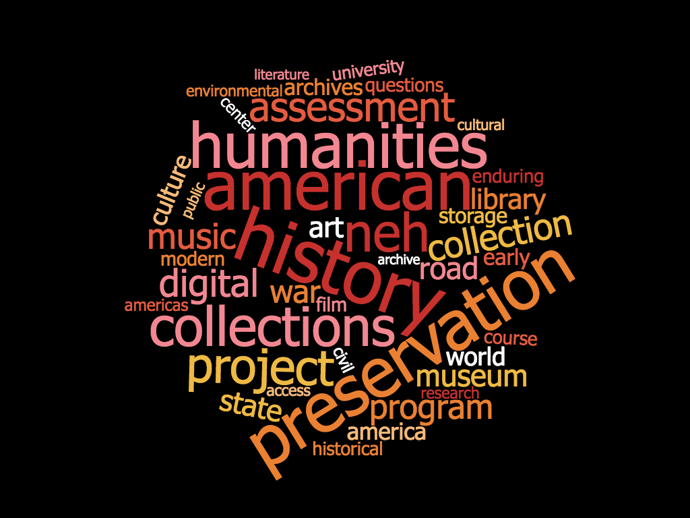
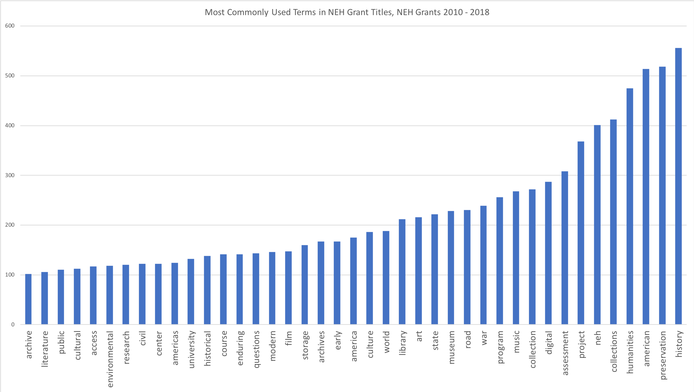
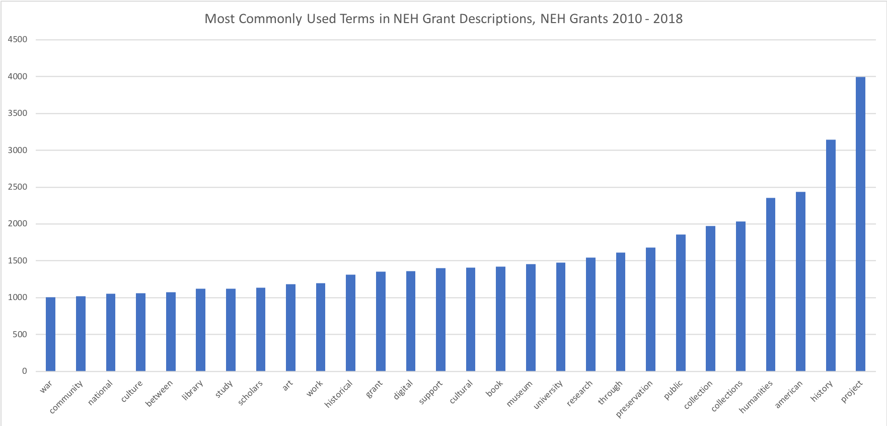
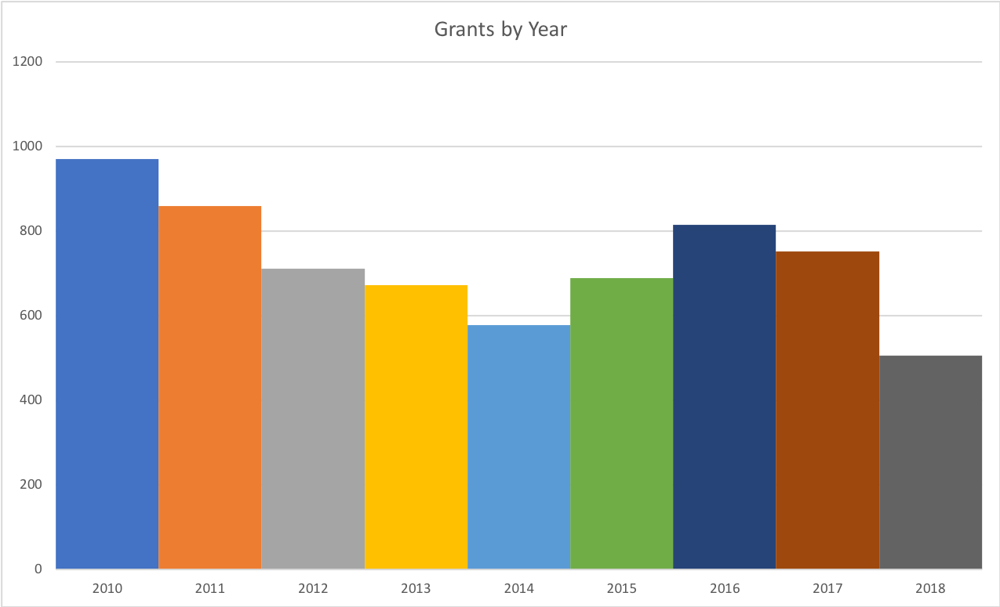
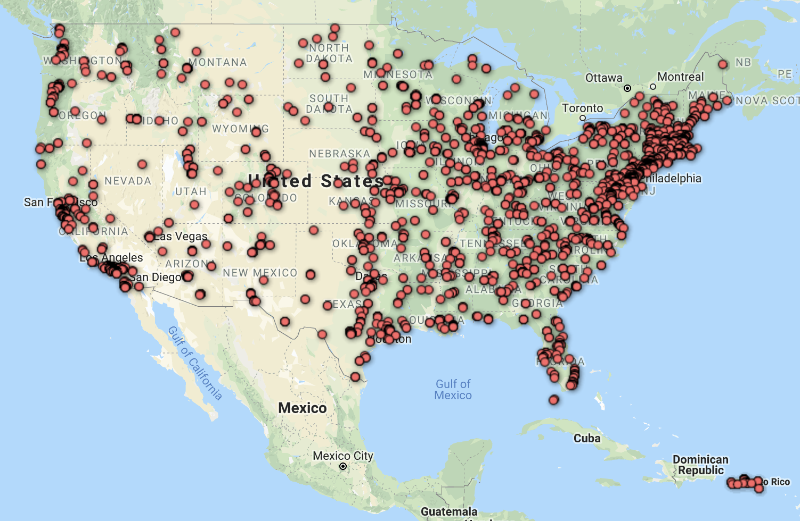

# funwithdata

> Open data to open understanding.

A place for odds and ends extracted from openly available data.

## NEH Grant Data, 2010 - 2018

Source: [https://catalog.data.gov/dataset/neh-grant-data-2010-2019](https://catalog.data.gov/dataset/neh-grant-data-2010-2019)

Most common terms used in grant titles

Most common terms used in grant descriptions

Grants by year (note that data was released before 2018 had ended, so this data may be slightly off)

Locations of all institutions / organizations awarded grants (made with Google Docs FusionTable plugin)

Note the spead, which lacks (at first glance) a strong bias towards population zones -- this is more a question than a note.
